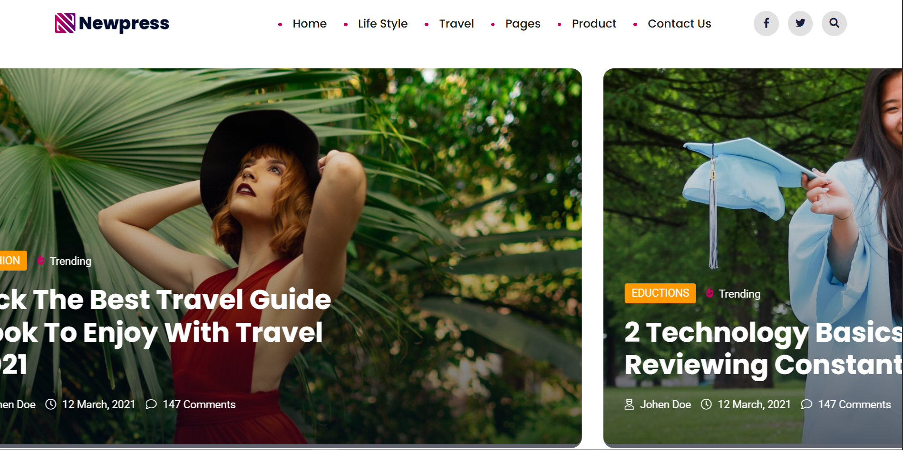

<!-- Added: brief project info and quick start -->

### About

Newpress is a small, responsive Next.js theme for news and magazine sites, inspired by the original Newpress HTML theme. This repo contains the Next app demo and the assets used for the preview.

### Installation

1. Ensure Node.js (v14+) and npm/yarn/pnpm are installed.
2. Clone the repo:
   git clone <repo-url>
3. Install dependencies:
   npm install
   # or: npm install | bun install
4. Run the development server:
   npm run dev
5. Build for production and run:
   npm run build
   npm start
   # or: NODE_ENV=production npm start

### Quick start

1. Clone the repo and open the `public` folder.
2. Serve the folder locally (for example: `npx serve public` or `python -m http.server` inside `public`).
3. Open the shown URL in your browser to view the demo landing page.
